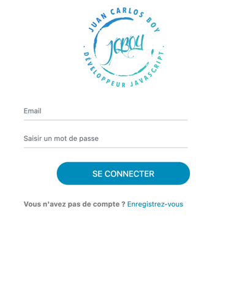

# Fretly app

Technologies:

- Angular
- Node.js
- MongoDB

Ce projet comporte 2 dossiers, un pour le front et un pour le back avec chacun leur
package.json de sorte qu'on puisse lancer le projet avec npm install + npm start

### Pages

#### 1. Page d'inscription
   
- Utilisateur avec 
  - 3 champs obligatoires: un email, un mdp, un type; si un champ manquant,
   message d'erreur visible par l'utilisateur
  - L'email est unique dans la BDD sinon retourne une erreur visible par l'utilisateur
    
- Le type d'utilisateur peut être soit transporteur, soit chargeur. Choix à l’aide d’un bouton radio.

#### 2. Page de Connection

- Page de connexion qui redirige vers la page d'accueil de l’utilisateur.

- On peut se connecter uniquement lorsqu’on a créé un utilisateur au préalable. 
  Pour cet exercice la sécurité n’est pas prise en compte, l’email et le 
  mot de passe sont envoyés en clair vers le backend et testés par rapport 
  à ceux de la base de données.

#### 3. Page d'accueil

- Affichage de la phrase: 
   “Il y a actuellement [NOMBRE] [‘Chargeur(s)’||’Transporteur(s)’] inscrit(s)”

**Aperçu**

